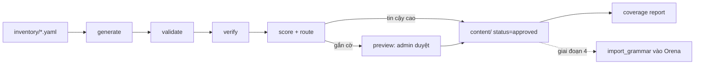

# Orena Grammar Lab — Spec v0.1

26/09/2026

## 1. Mục tiêu, phạm vi và nguyên tắc

Grammar Lab là một môi trường độc lập để sinh, kiểm tra và duyệt nội dung ngữ pháp đa ngôn ngữ cho Orena, trước khi gộp vào app. Mục tiêu cuối: admin chỉ duyệt các mục bị gắn cờ, không soạn bài từ đầu.

**Mục tiêu đo được**

- Sinh đủ bộ ngữ pháp cho một cặp (ngôn ngữ đích × L1) từ danh mục chính, độ phủ 100%.
- Tỉ lệ mục phải vào hàng đợi admin ≤ 20% sau khi hiệu chỉnh ngưỡng.
- Thời gian duyệt trung bình mỗi điểm ngữ pháp được đo và báo cáo mỗi lần chạy.
- Dữ liệu đầu ra import thẳng vào Orena, không phải sửa tay.

**Trong phạm vi**

- Ngôn ngữ đích: tiếng Anh (thử nghiệm đầu tiên), tiếng Trung, sau đó tiếng Nhật.
- L1: tiếng Việt trước, tiếng Trung sau. Locale giải thích: vi trước.
- Pipeline offline: sinh nháp, kiểm tra tự động, chấm độ tin cậy, báo cáo độ phủ.
- Trang preview kiêm công cụ duyệt.

**Ngoài phạm vi**

- Không sửa monolith, không tách microservice, không thay đổi engine chấm bài.
- Không có API hay bảng database của app cho đến giai đoạn 4.
- Không sinh nội dung theo từng request của người học (trừ ví dụ cá nhân hóa, thuộc giai đoạn 4).

**Nguyên tắc**

1. Hợp đồng duy nhất giữa lab và app là JSON Schema. Lab không import code app; app không import code lab.
2. Phần tất định (bảng biến đổi, timeline, câu hỏi theo mẫu) sinh bằng code; LLM chỉ viết phần cần ngôn ngữ tự nhiên.
3. Nguồn tham chiếu chỉ dùng làm danh mục kiểm tra (tên, level, mã), không diễn giải lại văn bản của nguồn.
4. Nội dung lưu dạng file trong git: mọi thay đổi của AI hay admin đều thấy được qua diff.
5. Làm trên feature branch riêng; `main` không bị động vào; merge qua review thủ công.

## 2. Kiến trúc tổng quan

Lab là một thư mục Python độc lập `grammar_lab/` trong cùng repo, trên branch `feature/grammar-lab`, chạy bằng CLI. Lưu trữ là file; không dùng database của app.



**Cấu trúc thư mục**

```
grammar_lab/
  README.md
  pyproject.toml                 # phụ thuộc riêng, không trộn với app
  schema/
    grammar_set.schema.json      # hợp đồng lab ↔ app
    inventory.schema.json
  inventory/
    en.yaml                      # danh mục chính tiếng Anh
    zh.yaml                      # (giai đoạn 3)
  functions/
    functions.yaml               # lớp chức năng giao tiếp dùng chung
  content/
    en/<grammar_point_id>.json   # mỗi điểm một file
  rules/
    en_morphology.py             # sinh bảng biến đổi tất định
  prompts/
    generate_point.md            # prompt có phiên bản
    blind_solve.md
  pipeline/
    cli.py                       # lệnh: generate | validate | verify | route | coverage | report
    generate.py
    validate.py
    verify.py
    route.py
    coverage.py
    llm_client.py                # bọc managed API, có cache theo hash input
    evaluator_client.py          # gọi engine chấm bài Orena
  preview/
    index.html                   # render + duyệt, đọc file JSON
    serve.py                     # server nhỏ để ghi status ngược vào file
  reports/
    <run_id>/report.json, report.html
  tests/
```

**Công nghệ**: Python 3.11+, `jsonschema`, `pydantic` cho model nội bộ, `typer` cho CLI, `pyyaml`. Preview là HTML + JS thuần, không build step. LLM sinh nội dung qua managed API; bước verify dùng engine chấm bài hiện có (qwen3:8b qua Ollama hoặc API staging).

**Lệnh chính**

```
python -m grammar_lab.pipeline.cli generate --lang en --l1 vi --ids en.past_simple,en.there_is_are
python -m grammar_lab.pipeline.cli validate --lang en
python -m grammar_lab.pipeline.cli verify --lang en --evaluator staging
python -m grammar_lab.pipeline.cli route --lang en
python -m grammar_lab.pipeline.cli coverage --lang en
python -m grammar_lab.pipeline.cli report --run latest
```

## 3. Mô hình dữ liệu

Dữ liệu có ba lớp: **function** (chức năng giao tiếp, dùng chung mọi ngôn ngữ), **grammar point** (theo ngôn ngữ đích), và **lớp locale/L1** nằm bên trong grammar point. File mẫu `sample_v0.1.json` là điểm xuất phát; spec này chuẩn hóa nó thành schema v0.2.

**Function**

| Trường | Kiểu | Ghi chú |
| --- | --- | --- |
| `id` | string | `fn.<snake_case>`, bất biến |
| `title` | map locale → string | vd. `{"vi": "Trải nghiệm đã từng"}` |
| `realizations` | map lang → string[] | ID grammar point của từng ngôn ngữ đích |
| `can_do_refs` | string[] | mã mô tả năng lực CEFR / 参照枠 liên quan (tùy chọn) |

**Grammar point**

| Trường | Kiểu | Ghi chú |
| --- | --- | --- |
| `id` | string | `<lang>.<slug>`, bất biến sau khi publish |
| `version` | int | tăng mỗi lần nội dung đổi |
| `target_lang` | string | BCP-47: `en`, `zh-Hans`, `ja` |
| `function` | string | ID function |
| `level` | object | `{framework, value, rank}`; framework cố định theo ngôn ngữ (en: CEFR, zh: HSK 3.0, ja: JLPT); `rank` là thứ tự trong thang của chính ngôn ngữ đó |
| `prereqs`, `contrasts` | string[] | ID grammar point cùng ngôn ngữ |
| `error_tags` | string[] | nhãn lỗi engine chấm bài dùng |
| `source_refs` | map | `{"egp": [...], "core_inventory": [...], "hsk3": [...]}` |
| `title`, `summary` | map locale → string | |
| `blocks` | Block[] | xem bảng dưới |
| `status` | enum | `draft_ai` → `auto_ok` / `flagged` → `approved` / `rejected` |
| `provenance` | object | model, prompt version, run_id, thời điểm sinh |
| `review` | object | người duyệt, thời gian duyệt (giây), ghi chú |

**Block types**

| Type | Trường chính | Nguồn sinh |
| --- | --- | --- |
| `formula` | `parts[]` | LLM |
| `rule_table` | `rows[[base, derived, note_i18n]]` | code (`rules/`) + LLM cho ghi chú |
| `timeline` | `kind`, `relevance?` | LLM chọn tham số; frontend vẽ |
| `example` | `text`, `seg[[chuỗi, nhãn?]]`, `ruby?`, `tr{locale}` | LLM |
| `contrast` | `with`, `pairs[]`, `explain{locale}` | LLM |
| `pitfall` | `l1[]`, `wrong`, `right`, `error_tag`, `why{locale}` | LLM |
| `bridge` | `l1`, `realization_id` | tự sinh từ function (không lưu, render lúc chạy) |
| `note` | `text{locale}` | LLM |
| `check` | `items[{q, options, answer, explain{locale}}]` | code theo mẫu + LLM |

**Thay đổi so với mẫu v0.1**

- `pitfall.l1` đổi từ chuỗi thành mảng; mỗi pitfall bắt buộc có `error_tag` để bước verify đối chiếu.
- `example.seg` là nguồn sự thật; `text` phải bằng phép ghép các đoạn. `ruby` là mảng song song cho pinyin/furigana.
- Thêm `version`, `source_refs`, `provenance`, `review`.
- Giá trị `timeline.kind` là enum đóng: `point_past`, `ongoing_now`, `unspecified_past`, `habit`, `future_condition`, `future_plan`, `past_ongoing`. Mở rộng enum phải kèm component vẽ tương ứng.

**Thang level**: mỗi ngôn ngữ đích dùng thang riêng, không quy đổi sang thang chung. Tiếng Anh dùng CEFR (A1–C2), tiếng Trung dùng HSK 3.0 (cấp 1–9), tiếng Nhật dùng JLPT (N5–N1). Trường `level_scales` trong schema khai báo danh sách cấp theo thứ tự cho từng ngôn ngữ; `rank` suy ra từ vị trí trong danh sách và chỉ dùng để sắp xếp, lọc và kiểm tra `prereqs` trong cùng một ngôn ngữ. Không so sánh level giữa các ngôn ngữ.

**Chữ tiếng Trung**: chỉ dùng giản thể (`zh-Hans`) cho cả nội dung và locale giải thích.

## 4. Danh mục chính (inventory) và nguồn tham chiếu

Mỗi ngôn ngữ đích có một file `inventory/<lang>.yaml`: danh sách phẳng các mục cần phủ, hợp nhất từ các nguồn, mỗi mục giữ mã nguồn gốc. Danh mục là thứ duy nhất được người duyệt toàn bộ, một lần.

```yaml
- inv_id: en.inv.0142
  label: Present perfect for experience (ever/never)
  level: {framework: cefr, value: A2}
  function: fn.past_experience
  sources:
    egp: ["<mã EGP>"]
    core_inventory: ["A2 grammar: present perfect"]
  maps_to: [en.present_perfect.experience]   # điền khi đã có grammar point
  status: approved   # proposed | approved | out_of_scope
```

**Nguồn theo ngôn ngữ**

| Ngôn ngữ | Xương sống | Đối chiếu | Lưu ý |
| --- | --- | --- | --- |
| Tiếng Anh | [English Grammar Profile](https://englishprofile.org/) (hơn 1.200 mô tả, A1–C2) | [Core Inventory for General English](https://www.teachingenglish.org.uk/publications/case-studies-insights-and-research/british-council-eaquals-core-inventory-general) (A1–C1) | Kiểm tra điều khoản sử dụng EGP cho mục đích thương mại |
| Tiếng Trung | 《国际中文教育中文水平等级标准》 phụ lục A, 572 điểm, 9 cấp | Giáo trình hiện dùng trong Orena | Không đưa nội dung Chinese Grammar Wiki vào pipeline: giấy phép cấm dùng thương mại |
| Tiếng Nhật | Danh mục ngữ pháp JLPT cũ (trước 2010) + syllabus giáo trình | 「日本語教育の参照枠」 (can-do, gắn vào lớp function) | Không có danh mục chính thức hiện hành; không có người bản ngữ nên áp dụng quy trình duyệt zh/ja ở mục 9 |

**Quy trình dựng danh mục**

1. Nhập nguồn thô vào `inventory/raw/<nguồn>.csv` (tên mục, level, mã). Chỉ nhập metadata, không nhập văn bản giải thích.
2. Lệnh `inventory merge`: LLM đề xuất gộp các mục trùng giữa nguồn và gán function; kết quả là `status: proposed`.
3. Người duyệt chấp nhận, sửa hoặc đánh dấu `out_of_scope` (có lý do). Một mục bị loại vẫn được giữ trong file.
4. Danh mục đã duyệt được đóng băng theo tag git; mọi thay đổi sau đó qua pull request.

Một grammar point của Orena có thể phủ nhiều mục inventory (gộp) và một mục inventory có thể cần nhiều grammar point (tách). Quan hệ này nằm ở `maps_to`.

## 5. Pipeline

Năm bước chạy tuần tự, mỗi bước đọc và ghi file trong `content/` và `reports/<run_id>/`. Mỗi bước chạy lại được độc lập và idempotent: chạy hai lần với cùng input cho cùng kết quả (LLM có cache theo hash input).

### 5.1 generate

- **Input**: danh sách ID grammar point (hoặc mục inventory chưa được map), `--lang`, `--l1`, `--locale`.
- **Việc làm**:
  1. Code sinh phần tất định: `rule_table` từ `rules/<lang>_morphology.py`.
  2. LLM (managed API) sinh các block còn lại theo prompt `prompts/generate_point.md`, output ép theo JSON Schema.
  3. Code sinh thêm 2–3 câu `check` theo mẫu: khoét đoạn có nhãn `target` trong câu ví dụ, lấy phương án nhiễu từ `rule_table` hoặc từ pitfall.
- **Output**: `content/<lang>/<id>.json` với `status: draft_ai`, `provenance` đầy đủ. Không ghi đè file có `status: approved`; thay vào đó tạo `version + 1` ở trạng thái nháp.
- **Ràng buộc prompt**: không chép văn bản nguồn; ví dụ dùng từ vựng trong level; mỗi pitfall gắn đúng một `error_tag` trong danh sách cho phép.

### 5.2 validate (không dùng LLM, phải chạy dưới 5 giây cho 100 điểm)

- JSON hợp lệ theo schema v0.2.
- `example`: ghép `seg` bằng đúng `text`; có ít nhất một đoạn nhãn `target`; `ruby` (nếu có) cùng độ dài với `seg`.
- `check`: `answer` nằm trong `options`; các `options` không trùng nhau.
- Tham chiếu: `function`, `prereqs`, `contrasts`, `with` trỏ tới ID tồn tại; đồ thị `prereqs` không có vòng.
- `error_tags` thuộc danh sách nhãn của engine chấm bài (file `schema/error_tags.json`, xuất từ app).
- Mọi trường locale bắt buộc có đủ các locale khai báo trong `meta`.
- Nội dung `zh-Hans` không chứa ký tự phồn thể.
- Lỗi validate → mục bị `flagged` với lý do `validate:<mã lỗi>`; không chạy bước verify cho mục đó.

### 5.3 verify

| Kiểm tra | Cách làm | Gắn cờ khi |
| --- | --- | --- |
| Engine khớp pitfall | Gửi câu `wrong` và `right` qua engine chấm bài | `wrong` không bị bắt đúng `error_tag`, hoặc `right` bị bắt lỗi |
| Ví dụ sạch | Gửi mọi câu `example` và câu `contrast` | Engine bắt bất kỳ lỗi ngữ pháp nào |
| Giải mù | Model thứ hai (khác model sinh) làm `check` không có đáp án | Chọn khác đáp án, hoặc báo có hơn một đáp án đúng |
| Level từ vựng | Đối chiếu từ trong ví dụ với danh sách từ theo level | Có từ vượt level của điểm ngữ pháp quá 1 bậc |
| Dịch ngược | Dịch `summary` và `why` về tiếng Anh, so nghĩa với bản gốc | Điểm tương đồng dưới ngưỡng |

`evaluator_client.py` có hai chế độ: `staging` (gọi API của orena.chillpickle.org) và `local` (import engine như thư viện). Lab không sửa engine. Nếu engine không trả về nhãn lỗi dạng máy đọc được, cần thêm một endpoint chỉ đọc ở giai đoạn 1 (xem mục 9).

### 5.4 score + route

Mỗi mục có điểm tin cậy 0–1 và danh sách lý do. Công thức khởi đầu (hiệu chỉnh ở giai đoạn 1 bằng gold set):

- Bắt đầu từ 1,0; trừ theo từng kiểm tra thất bại (engine khớp pitfall −0,4; ví dụ sạch −0,3; giải mù −0,3; level −0,1; dịch ngược −0,2).
- Hệ số rủi ro theo loại nội dung: `rule_table`, `timeline` thấp; `example`, `check` trung bình; `pitfall`, `summary`, `why` cao.

Luật định tuyến:

1. Có lỗi validate hoặc bất kỳ kiểm tra verify nào thất bại → `flagged`.
2. Ngôn ngữ đích hoặc L1 chưa qua gold set → `flagged` toàn bộ.
3. Còn lại, điểm ≥ ngưỡng → `auto_ok`; lấy mẫu ngẫu nhiên 10% `auto_ok` đưa vào hàng đợi để kiểm tra.

**Điểm tin cậy và ngưỡng: định nghĩa**

Điểm tin cậy là một số từ 0 đến 1 mà pipeline tính cho mỗi grammar point, ước lượng khả năng nội dung đó đúng mà không cần người sửa. Ngưỡng là mức điểm tối thiểu để một mục được tự duyệt (`auto_ok`); dưới ngưỡng thì vào hàng đợi.

| Tiêu chí đánh giá | Ai/cái gì đánh giá | Đầu vào |
| --- | --- | --- |
| Câu sai trong pitfall bị bắt đúng lỗi; câu đúng không bị bắt | Engine chấm bài của Orena | `pitfall.wrong`, `pitfall.right`, `error_tag` |
| Câu ví dụ và câu so sánh không có lỗi ngữ pháp | Engine chấm bài của Orena | `example`, `contrast` |
| Câu hỏi có đúng một đáp án đúng | Model thứ hai (khác model sinh), làm bài không xem đáp án | `check` |
| Từ vựng trong ví dụ không vượt level | Code, đối chiếu danh sách từ theo level | `example` |
| Lời giải thích giữ đúng nghĩa khi dịch ngược | Model thứ hai | `summary`, `why` |

Máy chấm điểm; người không chấm từng mục. Việc của người (chủ dự án cùng AI) là **đặt ngưỡng** và **kiểm tra xem ngưỡng có đáng tin không**:

1. Chạy pipeline cho gold set 20–30 mục, rồi tự duyệt toàn bộ và đánh dấu mục nào thật sự có lỗi.
2. So điểm máy với kết quả duyệt tay. Chọn ngưỡng thấp nhất sao cho trong các mục đạt ngưỡng, số mục thật sự có lỗi không quá 1/20 (5%, con số đề xuất, có thể đổi).
3. Giá trị khởi đầu trước khi có gold set: 0,8 cho tiếng Anh. Tiếng Trung và tiếng Nhật theo quy trình zh/ja ở mục 9.
4. Sau khi chạy thật, 10% mục `auto_ok` được lấy mẫu để duyệt lại. Nếu tỉ lệ lỗi trong mẫu vượt 5%, tăng ngưỡng và ghi lý do vào báo cáo.

### 5.5 coverage + report

- `coverage`: mọi mục inventory `approved` phải có `maps_to` trỏ tới ít nhất một grammar point `approved` hoặc `auto_ok`. In danh sách thiếu theo level.
- Khi có dữ liệu từ app (giai đoạn 4): liệt kê `error_tags` mà engine bắt được trong bài viết thật nhưng chưa gắn với grammar point nào.
- `report`: số mục theo trạng thái, tỉ lệ gắn cờ theo từng kiểm tra, chi phí API, thời gian duyệt trung bình. Xuất JSON và HTML.

## 6. Preview và công cụ duyệt

Một trang HTML tĩnh vừa hiển thị bài học đúng như người học sẽ thấy, vừa là hàng đợi duyệt của admin. Các component render ở đây là bản gốc sẽ được chuyển sang app ở giai đoạn 4.

**Hai chế độ xem**

- **Learner view**: render các block theo thứ tự, chọn locale và L1 để xem pitfall và bridge tương ứng.
- **Review view**: danh sách mục `flagged` và mẫu `auto_ok`, sắp theo điểm tin cậy tăng dần; mỗi mục hiện lý do gắn cờ ngay cạnh block có vấn đề.

**Component render (phải có ở giai đoạn 2)**

| Block | Hiển thị |
| --- | --- |
| `formula` | Chuỗi thẻ màu, mỗi `part` một thẻ |
| `timeline` | SVG tự vẽ từ `kind`: trục thời gian, mốc "now", điểm/khoảng sự kiện |
| `rule_table` | Bảng hai cột + ghi chú, cuộn ngang trên mobile |
| `example` | Câu có đoạn `target` được tô, ruby phía trên nếu có, bản dịch bật/tắt |
| `contrast` | Hai cột song song, cùng tô sáng |
| `pitfall` | Câu sai gạch đỏ → câu đúng, lời giải thích theo locale |
| `check` | Câu hỏi trắc nghiệm, chấm tại chỗ, hiện giải thích |

**Thao tác duyệt**

- Duyệt: `status → approved`, ghi `review.reviewer`, `review.seconds` (đo từ lúc mở mục).
- Sửa inline: sửa trực tiếp các trường văn bản; lưu lại chạy `validate` ngay cho mục đó.
- Yêu cầu sinh lại: nhập ghi chú; lab chạy lại `generate` cho mục đó với ghi chú đưa vào prompt.
- Từ chối: bắt buộc chọn lý do từ danh sách cố định (sai ngữ pháp, sai level, giải thích khó hiểu, pitfall không thực tế, khác). Lý do được thống kê để sửa prompt.

`preview/serve.py` là server cục bộ nhỏ, chỉ đọc và ghi file trong `content/`; không có đăng nhập, không deploy ra ngoài. Mọi lần lưu tạo một commit git tự động với thông điệp `review: <id> <hành động>`, để lịch sử duyệt nằm trong git.

## 7. Giai đoạn, deliverables và tiêu chí chấp nhận

Mỗi giai đoạn chỉ bắt đầu khi giai đoạn trước qua tiêu chí chấp nhận. Giai đoạn 0–3 không chạm vào code app.

| Giai đoạn | Deliverables | Tiêu chí chấp nhận |
| --- | --- | --- |
| 0. Hợp đồng | `grammar_set.schema.json` v0.2, `inventory.schema.json`, `error_tags.json` xuất từ app, file mẫu 10 điểm nâng lên v0.2 | File mẫu validate sạch; có test cho mỗi luật validate |
| 1. Pipeline tiếng Anh | `generate`, `validate`, `verify`, `route`, `report`; `rules/en_morphology.py`; gold set 20–30 mục do người duyệt toàn bộ | Chạy trọn cho 10 điểm từ một lệnh; báo cáo có tỉ lệ gắn cờ, độ khớp engine, thời gian duyệt; ngưỡng tin cậy được hiệu chỉnh trên gold set |
| 2. Preview | `preview/index.html`, `serve.py`, đủ 7 component render | Admin duyệt hết 10 điểm trong preview; ghi được thời gian duyệt; 3–5 người học thử hiểu bài mà không cần giải thích thêm |
| 3. Mở rộng | Inventory tiếng Anh đã duyệt; `coverage`; thêm `l1: zh`; inventory và gold set tiếng Trung | Coverage tiếng Anh 100%; tỉ lệ `flagged` ≤ 20%; gold set tiếng Trung qua quy trình duyệt zh/ja ở mục 9 |
| 4. Tích hợp | Xem mục 8 | Xem mục 8 |

**Thứ tự việc trong giai đoạn 1 (giao cho Claude Code)**

- [ ] Tạo branch `feature/grammar-lab` và khung thư mục
- [ ] Viết schema v0.2 và nâng file mẫu
- [ ] `validate.py` + test
- [ ] `evaluator_client.py` (chế độ staging trước)
- [ ] `llm_client.py` có cache
- [ ] `generate.py` + prompt v1
- [ ] `verify.py` (engine khớp pitfall, ví dụ sạch, giải mù)
- [ ] `route.py` + `report`
- [ ] Cập nhật `PROJECT_STATE.md` và `CURRENT_HANDOFF.md`

Kiểm tra level từ vựng và dịch ngược có thể để sang giai đoạn 3 nếu cần rút ngắn giai đoạn 1.

## 8. Kế hoạch tích hợp vào Orena (giai đoạn 4)

Tích hợp làm trên một feature branch mới `feature/grammar-integration`, sau feature flag `grammar_v2`. Lab vẫn là nơi sinh nội dung; app chỉ nhận dữ liệu một chiều.

**Database (Alembic, chạy được trên cả SQLite và PostgreSQL)**

| Bảng | Nội dung chính |
| --- | --- |
| `grammar_function` | id, title (JSON), realizations (JSON) |
| `grammar_point` | id, target_lang, function_id, level_framework, level_value, level_rank, current_version |
| `grammar_point_version` | point_id, version, payload (JSON nguyên file), status, published_at |
| `grammar_error_link` | error_tag, point_id (tra ngược từ lỗi sang bài) |
| `grammar_progress` | user_id, point_id, trạng thái học, lần cuối xem |

Lưu nguyên JSON trong `payload` để không phải migrate mỗi lần schema thêm block type; các cột tách riêng chỉ phục vụ truy vấn.

**Import**

- Lệnh `python -m app.cli import_grammar --path grammar_lab/content --lang en`.
- Chỉ nhận mục `approved` hoặc `auto_ok`; validate lại bằng cùng schema trước khi ghi.
- Upsert theo `id + version`; version cũ giữ lại, tiến độ người học gắn với `point_id` nên không mất khi đổi version.
- Chạy lại nhiều lần cho cùng kết quả.

**API (chỉ đọc)**

- `GET /api/grammar/points?lang=&level=&function=`
- `GET /api/grammar/points/{id}?locale=&l1=` trả nội dung đã lọc theo locale và L1, kèm block `bridge` tính lúc chạy.
- `GET /api/grammar/by-error/{error_tag}` cho phần feedback.

**Frontend**: chuyển 7 component từ preview sang app, giữ nguyên hợp đồng props = block JSON.

**Nối với engine chấm bài**: trong phần feedback, mỗi lỗi có `error_tag` được map sẵn sẽ hiện nút "Học điểm này", mở bài tương ứng và đưa câu sai của người học lên làm ví dụ đầu tiên. Đây là phần duy nhất gọi LLM lúc chạy, và có thể để sau phiên bản tích hợp đầu tiên.

**Tiêu chí chấp nhận**: import 10 điểm tiếng Anh lên staging; trang bài học hiển thị giống preview; nút "Học điểm này" hoạt động cho ít nhất 5 `error_tag`; tắt feature flag thì app chạy như cũ.

## 9. Rủi ro, câu hỏi mở và việc cần người quyết

**Rủi ro**

| Rủi ro | Ảnh hưởng | Cách giảm |
| --- | --- | --- |
| Engine chấm bài không trả nhãn lỗi dạng máy đọc được | Bước verify quan trọng nhất không chạy được | Kiểm tra ngay đầu giai đoạn 1; nếu thiếu, thêm endpoint chỉ đọc trả `error_tag` |
| qwen3:8b yếu với tiếng Trung/Nhật | Verify sai, bỏ lọt lỗi | Với zh/ja, dùng managed API cho bước verify và áp dụng quy trình duyệt zh/ja bên dưới |
| Model sinh và model kiểm tra sai giống nhau | Lỗi lọt qua các kiểm tra tự động | Dùng hai họ model khác nhau; gold set và mẫu 10% `auto_ok` để đo tỉ lệ lọt |
| Điều khoản sử dụng nguồn tham chiếu | Rủi ro pháp lý khi thương mại hóa | Chỉ lưu metadata; kiểm tra điều khoản EGP trước giai đoạn 3; không dùng Chinese Grammar Wiki |
| Chi phí API khi chạy toàn bộ danh mục | Vượt ngân sách | Cache theo hash; chạy theo lô nhỏ; báo cáo chi phí mỗi lần chạy |
| Schema đổi sau khi đã import | Phải migrate nội dung | Lưu nguyên JSON có `schema_version`; viết script nâng version thay vì sửa tay |

**Quy trình duyệt zh/ja khi không có người bản ngữ**

Người duyệt là chủ dự án cùng AI, nên với tiếng Trung và tiếng Nhật, kiểm tra tự động phải chặt hơn và phạm vi mở rộng dần:

- `pitfall`, `summary` và `why` của zh/ja luôn vào hàng đợi (`flagged`), không bao giờ `auto_ok`; ngưỡng tin cậy cho các block khác cao hơn tiếng Anh.
- Câu ví dụ phải được ít nhất hai họ model khác nhau (ngoài model sinh) cùng xác nhận là tự nhiên và đúng; bất đồng → gắn cờ.
- Mỗi điểm ngữ pháp đối chiếu cấu trúc và level với mô tả trong 语法等级大纲 (zh) hoặc danh mục JLPT cũ (ja); lệch level → gắn cờ.
- Trong preview, AI viết một đoạn "giải thích ngược" bằng tiếng Việt cho mỗi câu ví dụ (nghĩa từng thành phần) để người duyệt không đọc được tiếng Trung/Nhật vẫn kiểm tra được logic.
- Mở theo level: zh bắt đầu từ cấp 1–3, ja từ N5–N4; chỉ mở level cao hơn khi tỉ lệ báo lỗi từ người học ở level trước thấp hơn ngưỡng đặt ra.
- Sau khi publish, nút "báo lỗi" và tỉ lệ làm sai bất thường là kênh phát hiện chính; mục bị báo tự quay lại hàng đợi.

**Câu hỏi cần người quyết**

- [x] Người duyệt: chủ dự án cùng AI; không có người bản ngữ tiếng Trung và tiếng Nhật (đã quyết, xem quy trình duyệt zh/ja ở trên).
- [x] Thang level: mỗi ngôn ngữ dùng thang riêng (CEFR, HSK 3.0, JLPT), không quy đổi (đã quyết).
- [ ] Chốt ngưỡng tin cậy (định nghĩa ở mục 5.4) và tỉ lệ lấy mẫu `auto_ok` sau khi có số liệu gold set.
- [ ] Managed API nào dùng cho bước generate, và ngân sách mỗi lần chạy.
- [ ] Bộ `error_tags` hiện tại của engine có đủ chi tiết để gắn với grammar point không, hay cần mở rộng?
- [x] Tiếng Trung dùng chữ giản thể, không dùng phồn thể, áp dụng cho cả nội dung và locale giải thích (đã quyết); bước validate báo lỗi nếu gặp ký tự phồn thể.
- [ ] Khi nào chuyển trang preview thành công cụ admin trong app (sau giai đoạn 4 hay giữ riêng)?
