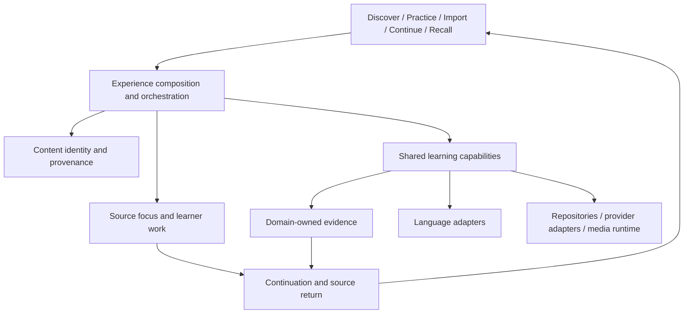

# Orena reference architecture

Status: IMPLEMENTATION BLUEPRINT. Written 2026-09-08 under the human's direction
that Codex owns Orena's system architecture and Opus implements feature detail.
This document specifies engineering structure beneath the Product Constitution
and Content Architecture. It does not replace either, declare product approval,
or claim that proposed interfaces are already implemented.

Current execution and acceptance evidence remain in CURRENT_HANDOFF.md and
GOLDEN_STAR_COMPLETION.md. Safety and domain authority remain in
ARCHITECTURE_INVARIANTS.md and DOMAIN_BOUNDARIES.md. The web extension guide owns
the current primitives and their usage, rather than duplicating them here.

## 1. The system being built

Orena is one learning product with multiple entry intentions and multiple
experience compositions. A learner can discover, deliberately practise, import,
continue or recall. Those entries converge on the same content identities,
capabilities and evidence. They do not converge on one compulsory screen.

The reference implementation must demonstrate two things together:

1. Experiences feel distinct because their content, attention and work differ.
2. Moving between them preserves source, useful context and learner work.

Navigation, experience composition, capability execution and storage are four
separate decisions. Changing a navigation group must not migrate data; adding a
capability must not create another media model; changing a provider must not
change what the learner's evidence means.



This is a dependency/relationship diagram, not a deployed event bus. There is no
new synchronization service or persistence layer implied by an arrow.

## 2. Architecture decisions for implementation

Preserve a modular application over the existing backend and browser modules.
Extract an explicit boundary when two experiences need the same behavior;
do not begin a framework rewrite or split services to make the diagram literal.

| Layer | Owns | Must not own |
| --- | --- | --- |
| Entry and shell | Orientation, destinations, language/theme controls, entry intent | Grading, content identity, capability-specific sessions |
| Experience composition | Attention hierarchy, content/work layout, available next actions | Provider selection, storage policy, copied capability engines |
| Experience orchestration | Current source/focus, work references, transition lifecycle | A second account record or authoritative mastery score |
| Content domain | Canonical identity, body/media, origin, rights, revisions | Learner success, review scheduling, UI layout |
| Learning capabilities | Dictation, comprehension, revision, speaking evidence, recall, explanation | Destination-specific copies of the source |
| Evidence owners | Meaning and validity of each measured or declared result | Inferring mastery from opening, saving or viewing |
| Language adapters | Segmentation, pronunciation, linguistic judgments | Separate English and Chinese products |
| Infrastructure | Existing repository, provider and media integrations | Learner navigation or pedagogical decisions |

The eleven current destinations remain intact. Their grouping is presentation,
not the domain architecture. Collection remains a deferred presentation decision;
its existence does not authorize consolidating or removing current destinations.

## 3. The shared experience boundary

Introduce a small, transient context contract where current callers repeatedly
assemble source, selection, language and return paths. This is a proposed browser
interface, not a database schema or a request to persist new learner data.

```ts
type ExperienceContext = {
  language: { learning: string; support: string; interface: string };
  source: {
    id: string;                 // Existing canonical ID; never a route label.
    kind: string;               // Existing content-kind vocabulary.
    revision?: string;          // Only when the content owner supplies one.
  };
  focus?: {
    segmentId?: string;         // For timestamped media.
    selection?: string;        // The exact selected original text.
    context?: string;          // Must contain the selection.
  };
  intention: string;            // Existing supported practice intention.
  workRef?: string;             // Existing draft/attempt/conversation identity.
  returnTo?: { sourceId: string; intention?: string; segmentId?: string };
};
```

The implementation adapts existing contracts to this boundary. It must not
replace canonical Media Learning payloads with this deliberately small object.
The shell must not own a growing object containing all provider outputs.

Rules at this boundary:

- UI language, learning language and support language remain distinct.
- A source focus is captured before an asynchronous request. A late response
  cannot use whichever segment or draft happens to be current on completion.
- A revision invalidates offsets into an earlier text. Keep the source revision
  where known; otherwise validate exact context before applying a result.
- Cross-capability actions carry source and work references, not copied route
  state. A return path resolves through the central intent/source resolver.
- A reference unavailable in the current language or account is unavailable;
  it must not silently reopen unrelated content.
- Read-only explanation is available without creating an attempt. Saving and
  grading remain separate, explicit learner actions.

## 4. Capability contract and availability

Each shared capability needs one adapter that translates its existing API into
what experiences can present. Use a discriminated outcome at the orchestration
boundary so empty data cannot be mistaken for success.

```ts
type CapabilityOutcome<T> =
  | { state: 'ready'; value: T }
  | { state: 'pending' }
  | { state: 'unavailable'; reason: string }
  | { state: 'failed'; reason: string; retryable: boolean };
```

These are proposed presentation outcomes, not replacements for backend envelopes.
Adapters preserve domain fields such as score kind, generated provenance,
dimension-level evidence and support-language availability. They must not turn
an existing failure into a `ready` demo response.

Availability has three independent dimensions:

| Dimension | Example | Consequence |
| --- | --- | --- |
| Content suitability | A text has no audio or no comprehension questions | Offer only meaningful actions for that content |
| Runtime readiness | ASR is unconfigured or microphone unavailable | Preserve typed work and explain the unavailable recording path |
| Authorization | Account or operational gate denies an operation | Preserve the denial; do not substitute another provider or identity |

Do not use `supports()` alone as proof of runtime readiness. A feature being
implemented and a provider being configured are different facts. Do not turn
temporary unavailability into a permanent route disappearance.

## 5. Content, work, evidence and memory are different objects

| Object | Current owner and evidence | Extension rule |
| --- | --- | --- |
| Media source, transcript, segments, translations | Canonical Media Learning | Reuse source/segment IDs for Follow, Dictation and Shadowing |
| Readable text and rights | `content/reading.js`, reading service and library admission | Every adapter ends at the readable contract; generated origin stays explicit |
| Work in progress | Existing draft/conversation/attempt contracts | Preserve pending work on navigation or failure; do not call it evidence |
| Learning evidence | Existing capability APIs and PostgreSQL repositories | Domain owns interpretation; no generic score synthesized by UI |
| Kept relationship | Existing vocabulary/content save contracts | Saving is not an origin, a recall success or a mastery claim |
| Continuation | Existing owner/language-scoped device memory | Points back to actual work; does not claim cross-device durability |

The learner-evidence chain is:

`action -> domain validation -> evidence result -> acknowledged write -> presentation`

A UI may keep a pending draft before a call; it may only say evidence was saved
after the owning API acknowledges it. Retry semantics belong to the domain write
contract. Do not add frontend deduplication and assume it guarantees server
idempotency. Do not repeat a successful write because only the refresh failed.

Derived learner state must retain which evidence supports its claim. Opening a
story, receiving a model response, keeping a word and revealing a recall card
are not interchangeable signals. Personalization consumes valid evidence when
available; it must not manufacture it to populate a dashboard.

## 6. Experience compositions and canonical journeys

Composition is a first-class architectural responsibility. Share behavior and
tokens; do not require every surface to use the same heading/card arrangement.

| Experience | Attention and working shape | Canonical journey |
| --- | --- | --- |
| Discover | Editorial spread with unequal emphasis, real sources and contrasting invitations | Content invitation -> encounter -> purposeful deeper action |
| Reading | Quiet readable measure, source/provenance at the margin, contextual inquiry near text | Passage -> selection -> meaning -> kept language or response |
| Listening | Synchronized media, original and meaning; optional work beside the source | Follow -> selected line -> Dictation/Shadowing -> understanding |
| Intentional Practice | Intention first; suitable material comes next | Choose intention -> choose real content -> same encounter capability |
| Writing | Learner draft central, source at the side, version-specific feedback | Draft -> evaluation -> grounded revision -> compare -> continue |
| Speaking | Situation and exchange, with measured evidence separate from coaching | Own take/typed turn -> evidence or response -> coaching -> next expression |
| Language Understanding | Focused source-bound layer usable from every experience | Selected text -> explanation -> follow-up -> optional keep |
| My Language | Collected language with origin and way back | Kept phrase -> originating context or retrieval |
| Recall | Retrieval prompt, explicit reveal and self-assessment | Origin-appropriate prompt -> attempt -> reveal -> domain review write |
| Continue | Actual unfinished threads, distinguished by work type | Thread -> same source/work -> next action |

For each row Opus supplies EN/ZH, light/dark and narrow/desktop/wide evidence.
The expected proof is the journey, including failure and return behavior, not
a screenshot of a populated component. Provider-held steps are recorded as such.

At narrow width the source and work remain reachable without trapping the learner
between nested scroll panes. Desktop may put them side by side. Wide screens
give more room to relationships and margins; prose must keep a readable measure.
Use the approved brand world's atmosphere at entry and transition moments, and
let the learner's actual text or media dominate while working.

## 7. Mapping the blueprint onto the existing repository

| Boundary | Existing anchor | Opus implementation seam |
| --- | --- | --- |
| Entry identity | `product/intent.js`, `ui/reference.js`, `app.js` | Keep routing centralized; separate orientation from rendering |
| Source/focus | `product/encounter.js`, content adapters | Adapt context at the caller boundary; preserve canonical payloads |
| Work and continuation | `product/memory.js`, `conversation.js`, `revision.js` | Retain scoped identity and lifecycle; keep storage behind existing adapter |
| Capability execution | `capabilities/`, `infrastructure/api.js` | Normalize outcomes without changing domain claims |
| Shared understanding | `ui/understanding.js` | All experiences pass exact source context through one interface |
| Evidence | `product/evidence.js`, backend learning domains | Preserve ownership and acknowledged-write semantics |
| Composition | `ui/`, theme and room CSS, semantic brand library | Extract reusable composition roles; avoid page-specific design systems |

One high-level context type does not justify a large global store, generic
workflow engine, plugin loader or second router. Introduce the minimum seam
demonstrated by two real consumers, then extend through it.

## 8. Account architecture and the scale boundary

Current truth: PostgreSQL owns runtime account/evidence persistence; several
work and provenance objects remain device-scoped. This is not a finished
multi-user synchronization design, and this blueprint does not authorize new
tables, migrations, account-sync behavior or deeper device storage.

The separate architecture package for the stated approximately 100,000-user
target must resolve, before Opus implements persistence:

1. Ownership and access rules for curated content, imported/private content,
   learner work and evidence; account isolation at service and repository edges.
2. Which work follows the account, which stays ephemeral, and explicit offline
   conflict/deletion/retention semantics. A timestamp alone is not a conflict rule.
3. Idempotency and version checks for attempts, revisions and evidence writes.
4. Provider/media job budgets, cancellation and retry ownership; expensive work
   cannot be repeated merely because a browser disconnected.
5. Measured concurrency, storage and latency assumptions. Registered users alone
   do not determine worker counts, cache size or database topology.
6. Backup/restore evidence, migration order, rollback boundaries and operational
   gates. No production operation is implied by the architecture package.

Codex owns that design and its tradeoffs; Opus must not choose a schema by
extending whichever frontend object is easiest to persist. Service splitting
and account synchronization remain design work, not implicit Golden Star UI work.

## 9. Implementation ownership and ordered packages

Codex defines boundaries, shared interfaces, tradeoffs, sequencing and acceptance
criteria. Opus implements interactions, styling, capability adapters and tests
inside those boundaries. Codex reviews cross-domain decisions and architectural
integration; it does not replace Opus by completing each small UI defect.

| Package | Owner and deliverable | Exit condition |
| --- | --- | --- |
| A. Context and transition seam | Codex contract; Opus adapters at two real consumers | Media -> explanation and Reading -> Writing preserve source/focus/work, including late-result rejection |
| B. Capability outcomes | Opus implements adapters against existing envelopes | Content, runtime and authorization failures remain distinct and truthful |
| C. Reference compositions | Opus completes each room against section 6 | Canonical journey and responsive visual evidence, no duplicated engine |
| D. Continuation integration | Opus uses existing memory contracts | Return preserves actual work and language scope; no new durability claim |
| E. Account/evidence architecture | Codex produces the separate design package | Ownership, consistency, migration and operational questions in section 8 resolved before implementation |
| F. Golden Star review | Human judges product; Codex assesses architectural consistency | Ledger closed with explicit limitations; no agent declares human acceptance |

Packages A-D may consume existing behavior without rewriting what already
works. E can be designed alongside them, but its implementation must wait for
the applicable architecture and operational gates. The open Encounter WIP is
an Opus task within C, not the governing mission.

## 10. Review questions for future extensions

- Does the new experience preserve source identity across entry and return?
- Is this a new composition, a new capability, or a language-specific adapter?
  Has its owner been chosen explicitly?
- Is the claimed evidence domain-owned, with provenance and acknowledged writes?
- Does a provider failure preserve the learner's existing work?
- Can the same capability be entered deliberately and contextually?
- Does the unavailable state distinguish absent content from failed loading?
- Can EN and ZH demonstrate the same journey with appropriate linguistic behavior?
- Does the browser show a distinct, coherent experience at all required widths?

If an extension needs new learner persistence or a cross-domain ownership
decision, return that architectural question to Codex with the concrete contract
gap. Do not solve it incidentally inside a room component.
